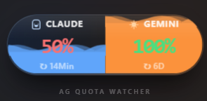
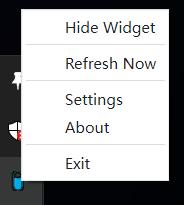
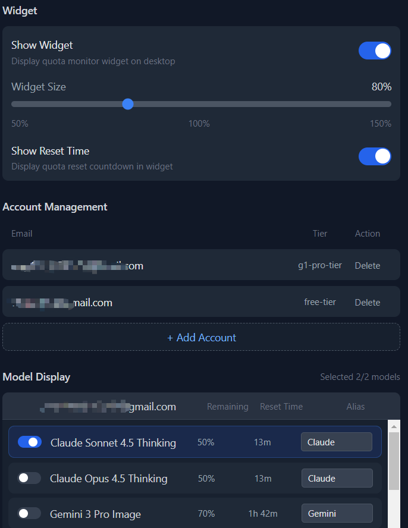

#  Float

#### Choose Your Language:  简体中文 | [English](./README.en.md)

> [!CAUTION]
> 本应用需要登录 Google 账号并获取 Access Token。Token 仅保存在本地，不会上传到任何服务器。
> 但请注意：**任何拥有你 Token 的人都可以访问你的 Google Cloud 资源**。请妥善保管你的配置文件。

**Float, 一个用于实时监控 Antigravity IDE AI 模型配额和 Kiro IDE Credits 剩余情况的独立桌面应用。**

这是 [Antigravity Quota Watcher](https://github.com/wusimpl/AntigravityQuotaWatcher) 插件的桌面版本，不依赖本地 Antigravity 环境，可随时随地查看剩余配额。

## 演示

<table>
  <tr>
    <td align="center">
      <strong>悬浮窗</strong><br><br>
      
    </td>
    <td align="center">
      <strong>系统托盘</strong><br><br>
      
    </td>
    <td align="center">
      <strong>设置页面</strong><br><br>
      
    </td>
  </tr>
</table>

## 系统要求


## 功能特性

- ✅ 实时监控 Antigravity AI 模型配额（如 Gemini-3-Pro 等）
- ✅ 支持 Kiro Credits 额度显示
- ✅ 桌面悬浮窗显示，最多同时监控 6 个模型
- ✅ 多账户管理
- ✅ 自定义模型别名
- ✅ 可调节刷新频率和警告阈值

## 安装方法

### Windows

[下载最新版本](https://github.com/wusimpl/AntigravityQuotaWatcherDesktop/releases/latest) 的安装包：
- **Setup 版本**：`.exe` 安装包，双击安装
- **Portable 版本**：免安装，解压即用

### macOS

[下载最新版本](https://github.com/wusimpl/AntigravityQuotaWatcherDesktop/releases/latest) 的 `.dmg` 文件：
- **x64**：Intel 芯片 Mac
- **arm64**：Apple Silicon (M1/M2/M3) Mac

拖拽到 Applications 文件夹后，由于应用未签名，首次打开会提示"应用程序已损坏，无法打开"。请在终端执行以下命令后再打开：

```bash
xattr -cr /Applications/Float.app
```
安装仍有疑问？请查看[这篇文章](https://sysin.org/blog/macos-if-crashes-when-opening/)

### Linux

[下载最新版本](https://github.com/wusimpl/AntigravityQuotaWatcherDesktop/releases/latest)：
- **AppImage**：免安装，添加执行权限后直接运行 (`chmod +x *.AppImage`)
- **deb**：Debian/Ubuntu 系统，使用 `sudo dpkg -i *.deb` 安装

## 使用方法

### 第一次使用

1. 启动应用后，点击托盘图标打开设置页面
2. 点击「添加账户」按钮，登录你的 Google 账号
3. 登录成功后，选择你想要监控的模型（最多选 6 个显示在悬浮窗）
4. 勾选「显示悬浮窗」，配额信息就会显示在桌面上

### 悬浮窗

悬浮窗最多显示 6 个模型的配额：

- 前 2 个模型采用「能量胶囊」设计，水位高度表示剩余配额百分比
- 第 3-6 个模型以 Mini Bar 形式紧凑显示在下方
- 可以拖拽到任意位置，位置会自动保存

### Kiro Credits 支持

本应用支持显示 Kiro Credits 额度：

- 在「模型选择」中可以选择 `Kiro Credits` 作为监控对象
- Kiro Credits 会显示剩余额度而不是百分比
- 重置周期固定显示为 "monthly"（按月重置）

### 设置页面

在设置页面可以：

- 管理 Google 账户（添加/删除）
- 选择要在悬浮窗显示的模型
- 设置模型别名（比如把 "gemini-3-pro" 简化成 "G Pro"）
- 调整刷新频率、警告阈值等

### 托盘菜单

右键点击托盘图标可以：

- 显示/隐藏悬浮窗
- 立即刷新配额
- 打开设置页面
- 退出应用

## 配额状态颜色

和插件版一样，配额状态用颜色区分：

- **绿色**：剩余配额 ≥ 50%（充足）
- **黄色**：剩余配额 30%-50%（警告）
- **红色**：剩余配额 < 30%（不足）
- **灰色**：配额已耗尽（0%）

阈值可以在设置中自定义。

## 常见问题

### 登录时浏览器打不开？

登录过程中会自动打开浏览器，如果没有打开，可以手动复制弹窗中的链接到浏览器访问。

### 悬浮窗不见了？

右键点击托盘图标，选择「显示悬浮窗」。

### 配额一直不更新？

1. 检查网络连接
2. 尝试删除账户后重新登录
3. 点击「立即刷新」手动刷新

### 如何设置代理？

打开代理开关，应用会自动检测系统代理（环境变量 `HTTP_PROXY`/`HTTPS_PROXY` 或系统代理设置）。如需手动指定代理，可在设置页面的「系统设置」中填写代理地址（如 `http://127.0.0.1:7890`）。留空则使用系统代理。

## 配置文件路径

本应用的所有配置（包括登录 Token）均保存在本地。如果需要备份、迁移或手动清理，可以在以下位置找到配置文件：

- **config.json**: 存储应用设置和模型配置
- **auth.json**: 存储 Google 账户登录 Token（已通过 `safeStorage` 加密）

**具体路径：**

**Windows:**
```
%APPDATA%\Float\
```

**macOS:**
```
~/Library/Application Support/Float/
```

**Linux:**
```
~/.config/Float/
```

## 提交 Issue

请在提交 issue 时说明：
- 你的操作系统版本
- 出现问题的具体步骤
- 如果有报错，请附上截图
- 请导出日志文件并上传：在设置页面 → 系统设置 → 点击「导出日志」按钮，选择保存位置后将日志文件附在 issue 中

## 项目使用约定

本项目基于 GPL-3.0 协议开源，使用此项目时请遵守开源协议。

除此外，希望你在使用代码时已经了解以下额外说明：

1. 打包、二次分发 **请保留代码出处**：[https://github.com/wusimpl/ag-quota-desktop](https://github.com/wusimpl/ag-quota-desktop)
2. 请不要用于商业用途，合法合规使用代码
3. 如果开源协议变更，将在此 Github 仓库更新，不另行通知

## 致谢
- [Antigravity-Manager](https://github.com/xisuo67/Antigravity-Manager) - Google API 登录流程参考

## 许可证

GPL-3.0 License
